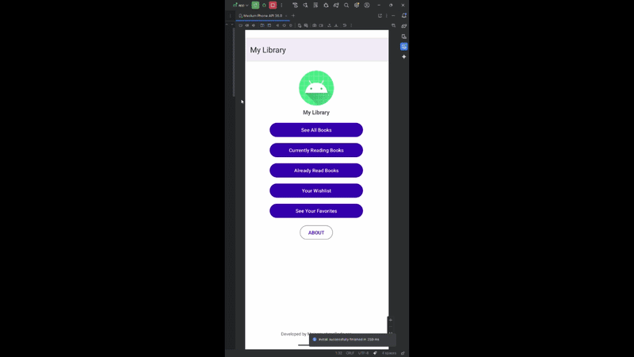

# 📚 MyLibraryApp

> A native Android application built with Java that allows users to organize and manage their personal book collection through an intuitive mobile interface.


---

# 📱 Application Demo

A brief demonstration of **MyLibraryApp** highlighting the application's user interface and core functionality.

<p align="center">
  
</p>

---

# 📖 Overview

MyLibraryApp is an Android application developed in Java that helps users organize and manage their personal book collection. Users can browse books, save favorites, track books they are currently reading, maintain a want-to-read list, and archive books they have already finished.

The goal of this project was to strengthen my understanding of Android development while gaining hands-on experience with object-oriented programming, persistent local data storage, and Android user interface design.

---

# ✨ Features

- 📚 Browse a library of books
- 📖 View detailed information for each book
- ⭐ Add books to a Favorites list
- 📌 Maintain a Want to Read collection
- ✅ Track books that have already been read
- 📖 Keep track of books currently being read
- 💾 Automatically save user data locally
- 📱 Clean and intuitive Android interface
- ⚡ Fast list rendering using RecyclerView

---

# 🛠 Technologies Used

| Technology | Purpose |
|------------|---------|
| Java | Core application development |
| Android Studio | Development environment |
| Android SDK | Mobile application framework |
| RecyclerView | Efficient list rendering |
| SharedPreferences | Persistent local storage |
| Gson | JSON serialization and object persistence |
| XML | User interface layouts |
| Gradle | Dependency management |
| Git & GitHub | Version control |

---

# 🏗 Application Architecture

The application follows a modular Activity-based architecture where each screen has a dedicated responsibility.

```text
MainActivity
│
├── AllBooksActivity
├── BookActivity
├── FavoritesActivity
├── WantToReadActivity
├── AlreadyReadActivity
└── CurrentlyReadingActivity
```

Data is managed through reusable utility classes and stored locally using SharedPreferences combined with Gson serialization.

---

# 🧠 Technical Skills Demonstrated

- Object-Oriented Programming (OOP)
- Android Activity Lifecycle
- RecyclerView Implementation
- Adapter Pattern
- Intent Navigation
- Local Data Persistence
- JSON Serialization
- XML User Interface Design
- Software Debugging
- Clean Code Organization

---

# 💡 Challenges & Solutions

### Challenge

Android's SharedPreferences only supports storing primitive data types, making it impossible to directly save Java objects.

### Solution

Implemented Google's Gson library to serialize Book objects into JSON before saving them and deserialize them when loading application data.

### Challenge

Managing multiple reading lists while keeping the data synchronized across several activities.

### Solution

Created reusable utility methods that handle list updates and data persistence while preventing duplicate entries and maintaining consistency throughout the application.

---

# 📚 What I Learned

Developing MyLibraryApp significantly strengthened my Android development skills and reinforced software engineering best practices.

Throughout this project I gained experience with:

- Designing Android applications using Java
- Building reusable and maintainable code
- Managing application state across multiple screens
- Implementing RecyclerViews and custom adapters
- Persisting complex data using SharedPreferences and Gson
- Debugging Android applications
- Organizing larger projects into modular components

This project also improved my problem-solving abilities by challenging me to find efficient solutions for data persistence and application architecture.

---

# 🚀 Future Improvements

Some enhancements I would like to implement include:

- 🔍 Search functionality
- ☁ Firebase Cloud Database
- 👤 User Authentication
- 🌙 Dark Mode
- ⭐ Book Ratings & Reviews
- 📊 Reading Statistics
- 📷 ISBN Barcode Scanner
- 🌐 Google Books API Integration
- 💾 Room Database implementation
- 🎨 Material Design 3 user interface

---

# ▶ Running the Project

## Prerequisites

- Android Studio
- Android SDK 34+
- Java 17

## Installation

Clone the repository:

```bash
git clone https://github.com/CalebG1301/MyLibraryApp.git
```

Open the project in Android Studio, allow Gradle to synchronize, connect an Android device or emulator, and click **Run**.

---

# 📈 Skills Showcased

- Java Programming
- Android Development
- Object-Oriented Programming
- RecyclerView
- SharedPreferences
- Gson
- XML Layout Design
- Git & GitHub
- Software Architecture
- Mobile Application Development
- Debugging & Problem Solving

---

# 👨‍💻 About the Developer

Hello! I'm **Caleb Gandee**, an Application Development graduate passionate about building software that solves real-world problems.

This project demonstrates my ability to design, develop, debug, and maintain a complete Android application using Java and Android Studio. It highlights my experience with object-oriented programming, local data persistence, and building intuitive mobile user interfaces.

I'm currently seeking an **entry-level Software Developer** position where I can contribute to a collaborative engineering team while continuing to expand my technical skills and build impactful software.

---

## ⭐ Thank You for Visiting!

Thank you for taking the time to explore **MyLibraryApp**. Feel free to browse the source code and explore my other repositories as I continue building my software development portfolio.
